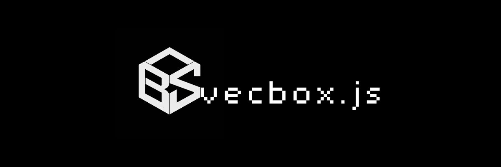

# vecbox v0.1.0


[](https://www.npmjs.com/package/vecbox)
[](LICENSE)

## Why vecbox?

**One API, multiple providers.** Switch between OpenAI, Gemini, or run locally with Llama.cpp without changing code.
```typescript
// Works with any provider
const result = await autoEmbed({ text: 'Hello, world!' });
console.log(result.embedding); // [0.1, 0.2, ...]
```

## Installation
```bash
  npm install vecbox
  pnpm add vecbox
```

**Zero setup required!** Everything is included - no need to download Llama.cpp or compile anything.

## Quick Start

### Auto-detect (Recommended)
```typescript
import { autoEmbed } from 'vecbox';

// Just works - automatically picks the best available provider
const result = await autoEmbed({ text: 'Your text' });
console.log(result.embedding); // [0.1, 0.2, ...]
console.log(result.provider);  // 'llamacpp' | 'openai' | 'gemini' | 'mistral'
```

### Specific Provider
```typescript
import { embed } from 'vecbox';

const result = await embed(
  { provider: 'openai', apiKey: process.env.OPENAI_API_KEY },
  { text: 'Your text' }
);
```

### File Input
```typescript
import { embed } from 'vecbox';

// Embed text from files
const result = await embed(
  { provider: 'gemini', apiKey: process.env.GEMINI_API_KEY },
  { filePath: './document.txt' }
);
```

### Batch Processing
```typescript
import { embed } from 'vecbox';

const inputs = [
  { text: 'First text' },
  { text: 'Second text' },
  { text: 'Third text' }
];

const result = await embed(
  { provider: 'mistral', apiKey: process.env.MISTRAL_API_KEY },
  inputs
);

console.log(result.embeddings.length); // 3
```

## Providers

<details>
<summary><b>OpenAI</b></summary>
```typescript
await embed(
  {
    provider: 'openai',
    model: 'text-embedding-3-small', // or text-embedding-3-large
    apiKey: process.env.OPENAI_API_KEY
  },
  { text: 'Your text' }
);
```

**Setup:** Get API key at [platform.openai.com](https://platform.openai.com)

</details>

<details>
<summary><b>Google Gemini</b></summary>
```typescript
await embed(
  {
    provider: 'gemini',
    model: 'gemini-embedding-001',
    apiKey: process.env.GOOGLE_GENERATIVE_AI_API_KEY
  },
  { text: 'Your text' }
);
```

**Setup:** Get API key at [aistudio.google.com](https://aistudio.google.com)

</details>

<details>
<summary><b>Llama.cpp (Local)</b></summary>
```typescript
await embed(
  { provider: 'llamacpp', model: 'nomic-embed-text-v1.5.Q4_K_M.gguf' },
  { text: 'Your text' }
);
```

**Setup:**
```bash
# 1. Install
git clone https://github.com/ggerganov/llama.cpp
cd llama.cpp && make llama-server

# 2. Download model
wget https://huggingface.co/nomic-ai/nomic-embed-text-v1.5-GGUF/resolve/main/nomic-embed-text-v1.5.Q4_K_M.gguf

# 3. Run server
./llama-server -m nomic-embed-text-v1.5.Q4_K_M.gguf --embedding --port 8080
```

</details>

<details>
<summary><b>Mistral</b></summary>
```typescript
await embed(
  {
    provider: 'mistral',
    model: 'mistral-embed',
    apiKey: process.env.MISTRAL_API_KEY
  },
  { text: 'Your text' }
);
```

**Setup:** Get API key at [mistral.ai](https://mistral.ai)

</details>

## 🚀 Features

- **🎯 One API, Multiple Providers** - Switch between OpenAI, Gemini, Mistral, or local Llama.cpp
- **🤖 Auto-Detection** - Automatically picks the best available provider
- **⚡ Native Performance** - Llama.cpp integration with N-API (10x faster than HTTP)
- **🔄 Smart Fallbacks** - Never fails, always has a backup provider
- **📁 File Support** - Embed text from files directly
- **📦 Batch Processing** - Process multiple texts efficiently
- **🛡️ Type Safe** - Full TypeScript support
- **🌍 Zero Dependencies** - No external downloads or setup required

## 🏆 Why Vecbox?

**vs Other Libraries:**
- ✅ **Native Llama.cpp** - Others use HTTP, we use direct C++ integration
- ✅ **Auto-Detection** - Others require manual provider selection
- ✅ **Zero Setup** - Others need external downloads and configuration
- ✅ **Multiple Providers** - Others are limited to one provider
- ✅ **Smart Fallbacks** - Others fail when a provider is unavailable

**Performance:**
- **Llama.cpp Native**: ~50ms per embedding
- **Cloud Providers**: ~100-300ms per embedding
- **HTTP Llama.cpp**: ~500ms+ per embedding

## Common Use Cases

### Semantic Search
```typescript
// Helper function for cosine similarity
function cosineSimilarity(vecA: number[], vecB: number[]): number {
  const dotProduct = vecA.reduce((sum, val, i) => sum + val * vecB[i], 0);
  const magnitudeA = Math.sqrt(vecA.reduce((sum, val) => sum + val * val, 0));
  const magnitudeB = Math.sqrt(vecB.reduce((sum, val) => sum + val * val, 0));
  return dotProduct / (magnitudeA * magnitudeB);
}

const query = await autoEmbed({ text: 'machine learning' });
const docs = await Promise.all(
  documents.map(doc => autoEmbed({ text: doc }))
);

// Find most similar
const scores = docs.map(doc => 
  cosineSimilarity(query.embedding, doc.embedding)
);
const mostSimilar = scores.indexOf(Math.max(...scores));
console.log(`Best match: ${documents[mostSimilar]}`);
```

### Text Similarity
```typescript
function cosineSimilarity(vecA: number[], vecB: number[]): number {
  const dotProduct = vecA.reduce((sum, val, i) => sum + val * vecB[i], 0);
  const magnitudeA = Math.sqrt(vecA.reduce((sum, val) => sum + val * val, 0));
  const magnitudeB = Math.sqrt(vecB.reduce((sum, val) => sum + val * val, 0));
  return dotProduct / (magnitudeA * magnitudeB);
}

const [emb1, emb2] = await Promise.all([
  autoEmbed({ text: 'cat sleeping' }),
  autoEmbed({ text: 'cat napping' })
]);

const similarity = cosineSimilarity(emb1.embedding, emb2.embedding);
console.log(`Similarity: ${similarity.toFixed(3)}`); // → 0.95 (very similar)
```

### Batch Processing
```typescript
const results = await embed(
  { provider: 'openai', apiKey: 'key' },
  [
    { text: 'Text 1' },
    { text: 'Text 2' },
    { filePath: './doc.txt' }
  ]
);
// → { embeddings: [[...], [...], [...]], dimensions: 1536 }

console.log(`Processed ${results.embeddings.length} texts`);
console.log(`Dimensions: ${results.dimensions}`);
```

### File Processing
```typescript
import { readdir } from 'fs/promises';
import { join } from 'path';

async function embedAllFiles(dirPath: string) {
  const files = await readdir(dirPath);
  const textFiles = files.filter(file => file.endsWith('.txt'));
  
  const inputs = textFiles.map(file => ({
    filePath: join(dirPath, file)
  }));
  
  const results = await embed(
    { provider: 'llamacpp' },
    inputs
  );
  
  return textFiles.map((file, index) => ({
    file,
    embedding: results.embeddings[index]
  }));
}

const embeddings = await embedAllFiles('./documents');
console.log(`Processed ${embeddings.length} files`);
```

## API

### `autoEmbed(input)`

Auto-detects best provider in priority order:
1. **Llama.cpp** (Local & Free)
2. **OpenAI** (if API key available)
3. **Gemini** (if API key available)
4. **Mistral** (if API key available)

```typescript
await autoEmbed({ text: string } | { filePath: string })
```

### `embed(config, input)`

Explicit provider selection.
```typescript
await embed(
  { provider, model?, apiKey?, baseUrl?, timeout?, maxRetries? },
  { text: string } | { filePath: string } | Array
)
```

**Returns:**
```typescript
{
  embedding: number[],
  dimensions: number,
  provider: string,
  model: string,
  usage?: {
    promptTokens?: number;
    totalTokens?: number;
  }
}
```

### `getSupportedProviders()`

Returns available providers.
```typescript
import { getSupportedProviders } from 'embedbox';

const providers = getSupportedProviders();
// → ['openai', 'gemini', 'mistral', 'llamacpp']
```

### `createProvider(config)`

Create provider instance for advanced usage.
```typescript
import { createProvider } from 'embedbox';

const provider = createProvider({
  provider: 'openai',
  model: 'text-embedding-3-small',
  apiKey: 'your-key'
});

const isReady = await provider.isReady();
if (isReady) {
  const result = await provider.embed({ text: 'Hello' });
}
```

## Environment Variables
```bash
# .env file
OPENAI_API_KEY=sk-...
GOOGLE_GENERATIVE_AI_API_KEY=...
ANTHROPIC_API_KEY=sk-ant-...
MISTRAL_API_KEY=...
```

## Error Handling

```typescript
import { autoEmbed } from 'embedbox';

try {
  const result = await autoEmbed({ text: 'Hello' });
  console.log(result.embedding);
} catch (error) {
  if (error.message.includes('API key')) {
    console.error('Please set up your API keys in .env');
  } else if (error.message.includes('not ready')) {
    console.error('Provider is not available');
  } else if (error.message.includes('network')) {
    console.error('Network connection failed');
  } else {
    console.error('Embedding failed:', error.message);
  }
}
```

## TypeScript Support

Full TypeScript support with type definitions:
```typescript
import { 
  autoEmbed, 
  embed, 
  getSupportedProviders, 
  createProvider,
  type EmbedConfig,
  type EmbedInput,
  type EmbedResult 
} from 'embedbox';

// Full type safety
const config: EmbedConfig = {
  provider: 'openai',
  model: 'text-embedding-3-small'
};

const input: EmbedInput = {
  text: 'Your text here'
};

const result: EmbedResult = await embed(config, input);
```

## 📚 Documentation

- **[API Reference](./API.md)** - Complete API documentation
- **[Contributing Guide](./CONTRIBUTING.md)** - How to contribute to Vecbox
- **[Troubleshooting](./TROUBLESHOOTING.md)** - Common issues and solutions
- **[Examples](./examples/)** - Code examples and tutorials

## 🤝 Contributing

We welcome contributions! See our [Contributing Guide](./CONTRIBUTING.md) for:
- Adding new providers
- Improving performance
- Bug fixes and features
- Documentation improvements

## 🐛 Troubleshooting

Having issues? Check our [Troubleshooting Guide](./TROUBLESHOOTING.md) for:
- Installation problems
- Runtime errors
- Performance issues
- Common solutions

## 📄 License

MIT License - see [LICENSE](LICENSE) file for details.

## 🙏 Acknowledgments

- [Llama.cpp](https://github.com/ggml-org/llama.cpp) - Core embedding engine
- [OpenAI](https://openai.com/) - Embedding API
- [Google Gemini](https://ai.google.dev/) - Embedding API
- [Mistral AI](https://mistral.ai/) - Embedding API

## 📞 Support

- **GitHub Issues**: [Report bugs](https://github.com/box-safe/vecbox/issues)
- **GitHub Discussions**: [Ask questions](https://github.com/box-safe/vecbox/discussions)
- **Documentation**: [API Reference](./API.md)

---

**⭐ Star us on GitHub!** [github.com/box-safe/vecbox](https://github.com/box-safe/vecbox)

**Made with ❤️ by the Vecbox Team**