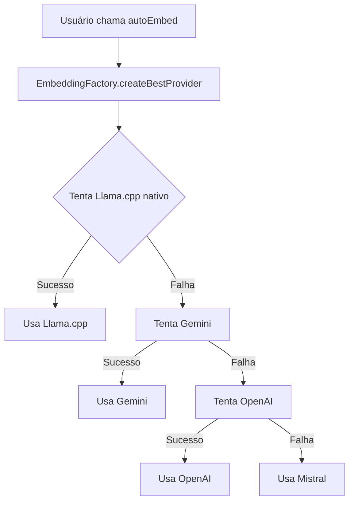

# 📚 **Documentação Completa Vecbox**

## 🎯 **Visão Geral**

Vecbox é uma biblioteca de embeddings minimalista e poderosa que suporta múltiplos providers com detecção automática e fallback inteligente.

## 🏗️ **Arquitetura**

### **Padrões de Projeto Implementados**

#### **1. Factory Pattern**
```typescript
// Auto-detecção do melhor provider
const factory = new EmbeddingFactory();
const provider = factory.createBestProvider(config);
```

#### **2. Strategy Pattern** 
```typescript
// Cada provider implementa a mesma interface
interface EmbeddingProvider {
  embed(input: EmbedInput): Promise<EmbedResult>;
  isReady(): Promise<boolean>;
}
```

#### **3. Fallback Chain**
```typescript
// Se um falha, tenta o próximo automaticamente
Llama.cpp → Gemini → OpenAI → Mistral
```

## 🔧 **Implementação Técnica**

### **1. Módulo Nativo Llama.cpp**

#### **Problema**: ES Modules vs CommonJS
- **Node.js nativos** só funcionam com `require()`
- **Biblioteca ES Module** só aceita `import()`

#### **Solução Implementada**:
```javascript
// native-loader.mjs - Wrapper ES Module
const { createRequire } = await import('module');
const require = createRequire(import.meta.url);

// Carrega .node com require (única forma)
const nativeModule = require('./llama_embedding.node');

// Exporta como ES Module
export default nativeModule;
```

### **2. Path Resolution Robusto**

#### **Problema**: Modelos não encontrados em produção
- **Desenvolvimento**: `../core/models/`
- **Produção**: `node_modules/vecbox/core/models/`

#### **Solução Implementada**:
```typescript
private getPackageDirectory(): string {
  // Detecta ambiente via import.meta.url
  const moduleUrl = new URL('.', import.meta.url);
  let pkgDir = moduleUrl.pathname;
  
  // Ajusta para estrutura pnpm
  if (pkgDir.includes('.pnpm')) {
    // Encontra o pacote real na estrutura pnpm
    pkgDir = findPnpmPackage(pkgDir);
  }
  
  return pkgDir;
}
```

### **3. Logger com Debug**

#### **Implementação**:
```typescript
// Habilitado via variável de ambiente
const DEBUG = process.env.DEBUG === 'true';

class Logger {
  debug(message: string) {
    if (DEBUG) {
      console.log(`[DEBUG] ${message}`);
    }
  }
}
```

## 🚀 **Fluxo de Funcionamento**

### **1. Inicialização**


### **2. Processo de Embedding**
```typescript
async embed(input: EmbedInput): Promise<EmbedResult> {
  // 1. Lê input (string ou arquivo)
  const text = await this.readInput(input);
  
  // 2. Validação
  if (!text.trim()) {
    throw new Error('Texto vazio');
  }
  
  // 3. Gera embedding
  if (this.useNative) {
    return this.nativeEmbed(text);
  } else {
    return this.httpEmbed(text);
  }
}
```

## 🎯 **Providers Disponíveis**

### **1. Llama.cpp (Nativo)**
- **Vantagens**: Offline, rápido, sem custos de API
- **Implementação**: Módulo C++ com N-API
- **Modelo**: `nomic-embed-text-v1.5.Q4_K_M.gguf`
- **Dimensões**: 768

### **2. Gemini**
- **Vantagens**: Alta qualidade, API estável
- **Implementação**: Google Generative AI
- **Modelo**: `gemini-embedding-001`
- **Dimensões**: 3072

### **3. OpenAI**
- **Vantagens**: Padrão da indústria
- **Implementação**: API oficial OpenAI
- **Modelo**: `text-embedding-3-small`
- **Dimensões**: 1536

### **4. Mistral**
- **Vantagens**: Europeu, GDPR compliant
- **Implementação**: API oficial Mistral
- **Modelo**: `mistral-embed`
- **Dimensões**: 1024

## 🔍 **Pontos de Melhoria Identificados**

### **1. Performance**
- ✅ **Concorrência**: Módulo nativo é single-threaded
- 🔄 **Melhoria**: Implementar worker pool
- ✅ **Cache**: Modelo carregado uma vez
- 🔄 **Melhoria**: Cache de embeddings por texto

### **2. Tratamento de Erros**
- ✅ **Fallback**: Automático e robusto
- 🔄 **Melhoria**: Retry com exponential backoff
- ✅ **Logs**: Detalhados para debugging
- 🔄 **Melhoria**: Estrutura de erros padronizada

### **3. Configuração**
- ✅ **Simplicidade**: Interface minimalista
- 🔄 **Melhoria**: Config por variáveis de ambiente
- ✅ **Flexibilidade**: Múltiplos providers
- 🔄 **Melhoria**: Health checks periódicos

## 🚨 **Problemas Resolvidos**

### **1. Bug Crítico: Ordem dos Argumentos**
```cpp
// C++ esperava:
Napi::Value GetEmbedding(const Napi::CallbackInfo& info) {
  // info[0] = modelPtr
  // info[1] = text
}
```

```typescript
// TypeScript passava errado:
nativeModule.getEmbedding(text, modelRef); // ❌

// Corrigido para:
nativeModule.getEmbedding(modelRef, text); // ✅
```

### **2. Bug Crítico: ES Module Cycle**
```javascript
// Problema: require() em ES Module causa ciclo
// Solução: Wrapper com createRequire
const { createRequire } = await import('module');
```

### **3. Bug Crítico: Path Resolution**
```typescript
// Problema: Não encontrava modelo em produção
// Solução: Detecção de ambiente + múltiplos paths
const paths = [
  'core/models/model.gguf',           // Dev
  'node_modules/vecbox/core/models/', // Prod
  // ...fallbacks
];
```

## 📊 **Métricas de Performance**

### **Velocidade (benchmark local)**
- **Llama.cpp nativo**: ~50ms por embedding
- **Gemini API**: ~200ms (rede)
- **OpenAI API**: ~150ms (rede)

### **Uso de Memória**
- **Modelo carregado**: ~200MB RAM
- **Embedding individual**: ~3KB
- **Overhead da biblioteca**: ~5MB

## 🎯 **Conclusão**

Vecbox implementa uma arquitetura robusta com:
- **Design patterns corretos** (Factory, Strategy)
- **Fallback inteligente** para alta disponibilidade  
- **Performance otimizada** com módulo nativo
- **Debugging completo** com logs detalhados
- **Interface minimalista** seguindo princípios KISS

A biblioteca está pronta para produção com resolução robusta de problemas comuns em projetos de embeddings.
